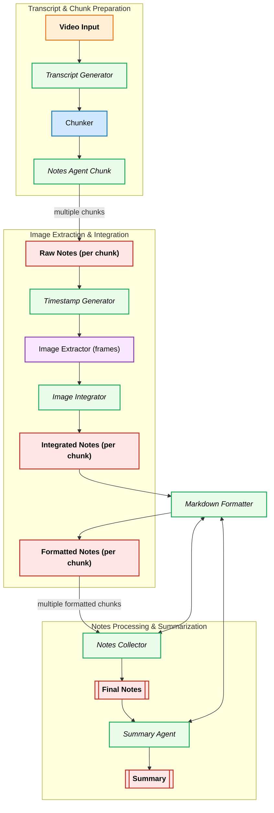

# 📚 VidScribe

VidScribe is an AI-powered tool that turns videos into **structured, markdown-style notes** with optional **images extracted from the video**. It helps people who understand better through written content but struggle to retain knowledge from videos.

## 🚀 Project Goals

- Convert **video transcripts** into clean, well-structured notes.
- Enrich notes with **key frames/images** from the video.
- Provide an **optional summary** for quick review.
- Simple **Gradio app** for the MVP (later React frontend planned).

## 🛠️ Tech Stack

- **Backend / Orchestration**: Python, FastAPI (future), LangGraph
- **LLM**: OpenAI (or other LLMs)
- **Transcript**: Whisper / YouTube Transcript API
- **Video Frames**: ffmpeg / OpenCV + CLIP (optional filtering)
- **Frontend (MVP)**: Gradio
- **Future Frontend**: React

## 📂 Planned Project Structure (MVP)

In the `backend/` folder:

```bash
VidScribe/
│── app/
│   ├── main.py               # Gradio entrypoint
│   ├── graph/
│   │   ├── langgraph.py      # Graph assembly
│   │   └── nodes/            # Individual pipeline nodes
│   │       ├── transcript.py
│   │       ├── chunker.py
│   │       ├── notes_agent.py
│   │       ├── summary_agent.py
│   │       ├── frame_extractor.py
│   │       └── formatter.py
│── outputs/                  # Generated notes & images
│   ├── notes.md
│   ├── summary.md
│   └── images/
│── requirements.txt
│── README.md
```

## 📅 Development Plan

- **Weekend 1**: Transcript → Structured Notes (MVP text only).
- **Weekend 2**: Add image extraction + integrate into notes.
- **Weekend 3**: Add summary + polish Gradio app.
- **Weekend 4+**: Move to full FastAPI + React app.

## 🧪 FastAPI (API) Quickstart

A minimal FastAPI server is available alongside the Gradio app with two endpoints:

- POST /run/stream — live progress via Server-Sent Events (SSE)
- POST /run/final — run to completion and return the final result as JSON

How to run locally:

```bash
cd backend
pip install -r requirements.txt
uvicorn fastapi_app:app --host 0.0.0.0 --port 8000 --reload
```

Example requests (now also require a `video_path` pointing to the local downloaded video; this is used for frame extraction):

- Streaming (SSE). You can test with curl; it will print events as they arrive.

```bash
curl -N -H "Content-Type: application/json" \
  -X POST http://localhost:8000/run/stream \
  -d '{
    "video_id": "wjZofJX0v4M",
    "video_path": "/home/USER/Desktop/VidScribe/backend/outputs/videos/wjZofJX0v4M/Transformers_the_tech_behind_LLMs_Deep_Learning_Chapter_5.mp4",
    "num_chunks": 2,
    "provider": "google",
    "model": "gemini-2.0-flash",
    "stream_config": { "include_data": true }
  }'
```

- Final-only JSON result:

```bash
curl -H "Content-Type: application/json" \
  -X POST http://localhost:8000/run/final \
  -d '{
    "video_id": "wjZofJX0v4M",
    "video_path": "/home/USER/Desktop/VidScribe/backend/outputs/videos/wjZofJX0v4M/Transformers_the_tech_behind_LLMs_Deep_Learning_Chapter_5.mp4",
    "num_chunks": 2,
    "provider": "google",
    "model": "gemini-2.0-flash"
  }'
```

Notes:

- The API reuses the existing LangGraph pipeline. For streaming, each SSE event now has shape `{ phase, progress, message, data, counters, stream }` (see schema below).
- New pipeline phase: `image_integration` appears between `chunk_notes` and formatting when images are being integrated per chunk.
- Progress mapping (heuristic): `chunks` (~20%) → `chunk_notes` (20–40%) → `image_integration` (40–50%) → `format_docs` (50–80%) → `collect_notes` (90%) → `summary` (100%).
- `video_path` must point to the local MP4 used for frame extraction. You can derive it from the downloaded video directory (e.g. `backend/outputs/videos/{video_id}/...mp4`).
- CORS is enabled for local development by default. Restrict origins before deploying.

### Event/response schema

- SSE event (from `/run/stream`):

```jsonc
{
  "phase": "chunk_notes", // string lifecycle phase
  "progress": 35, // 0-100 (heuristic)
  "message": "Chunk notes generated", // human-readable
  "data": {
    // shaped state subset
    "chunks": ["..."],
    "chunk_notes": ["..."],
    "image_integrated_notes": ["..."],
    "formatted_notes": ["..."],
    "collected_notes": "...",
    "summary": "...",
    "timestamps_output": [[{ "timestamp": "00:00:42", "reason": "..." }]],
    "image_insertions_output": [
      [{ "timestamp": "00:00:42", "line_number": 3, "caption": "..." }]
    ],
    "extracted_images_output": [
      [{ "timestamp": "00:00:42", "frame_path": ".../frame.jpg" }]
    ],
    "integrates": [
      /* per-chunk integration objects */
    ]
  },
  "counters": {
    // derived real-time metrics
    "expected_chunks": 10,
    "notes_created": { "current": 3, "total": 10 },
    "integrated_image_notes_created": { "current": 2, "total": 10 },
    "formatted_notes_created": { "current": 1, "total": 10 },
    "timestamps_created": {
      "current_items": 18,
      "chunks_completed": 3,
      "total_chunks": 10
    },
    "image_insertions_created": {
      "current_items": 12,
      "chunks_completed": 2,
      "total_chunks": 10
    },
    "extracted_images_created": {
      "current_items": 5,
      "chunks_completed": 2,
      "total_chunks": 10
    },
    "finalization": { "collected": false, "summary": false },
    "notes_by_type": {
      "raw": 3,
      "integrated": 2,
      "formatted": 1,
      "collected": 0,
      "summary": 0
    }
  },
  "stream": {
    // stream metadata
    "mode": "values", // "values" | "updates"
    "update": null // present only for updates
  }
}
```

- Final-only response (from `/run/final`) mirrors a single event without the `stream` block:

```jsonc
{
  "phase": "done",
  "progress": 100,
  "message": "Graph execution completed",
  "data": {
    /* same shape as above */
  },
  "counters": {
    /* same shape as above */
  }
}
```

### stream_config

The `stream_config` object controls shaping of `data`:

- `include_data` (bool): default true
- `include_fields` (list of strings): subset of fields to include. Valid keys:
  - `chunks`, `chunk_notes`, `image_integrated_notes`, `formatted_notes`, `collected_notes`, `summary`
  - `timestamps_output`, `image_insertions_output`, `extracted_images_output`, `integrates`
- `max_items_per_field` (int): truncate list fields
- `max_chars_per_field` (int): truncate long strings and list items

## ⚠️ Status

MVP is under active development: transcript → structured notes working; image extraction & integration stage added; API and Gradio support streaming with selectable fields including `image_integrated_notes`. Stream events now include derived `counters` and `stream` metadata to support richer progress UIs.

### Gradio UI enhancements

- Live "Stats" panel with compact progress bars and tables for:
  - Raw/Integrated/Formatted notes by chunk
  - Timestamps, Image insertions, Extracted images (items + chunks)
- "Stream" badge showing whether the current event is a cumulative `values` snapshot or an `updates` delta.

## The Architecture


