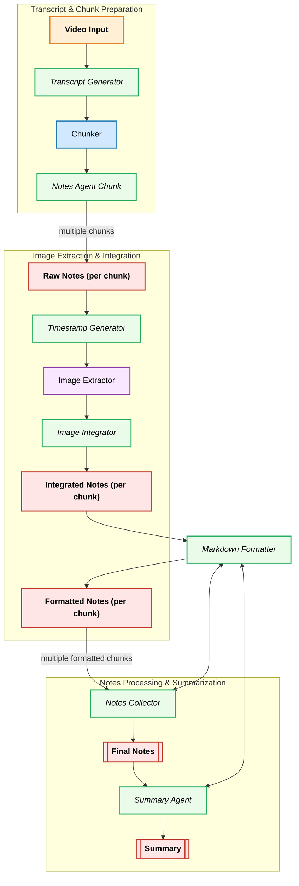

# 📚 VidScribe

VidScribe is an AI-powered tool that turns videos into **structured, markdown-style notes** with optional **images extracted from the video**. It helps people who understand better through written content but struggle to retain knowledge from videos.

## 🚀 Project Goals

- Convert **video transcripts** into clean, well-structured notes.
- Enrich notes with **key frames/images** from the video.
- Provide an **optional summary** for quick review.
- Simple **Gradio app** for the MVP (later React frontend planned).

## 🛠️ Tech Stack

- **Backend / Orchestration**: Python, FastAPI (future), LangGraph
- **LLM**: OpenAI (or other LLMs)
- **Transcript**: Whisper / YouTube Transcript API
- **Video Frames**: ffmpeg / OpenCV + CLIP (optional filtering)
- **Frontend (MVP)**: Gradio
- **Future Frontend**: React

## 📂 Planned Project Structure (MVP)

In the `backend/` folder:

```bash
VidScribe/
│── app/
│   ├── main.py               # Gradio entrypoint
│   ├── graph/
│   │   ├── langgraph.py      # Graph assembly
│   │   └── nodes/            # Individual pipeline nodes
│   │       ├── transcript.py
│   │       ├── chunker.py
│   │       ├── notes_agent.py
│   │       ├── summary_agent.py
│   │       ├── frame_extractor.py
│   │       └── formatter.py
│── outputs/                  # Generated notes & images
│   ├── notes.md
│   ├── summary.md
│   └── images/
│── requirements.txt
│── README.md
```

## 📅 Development Plan

- **Weekend 1**: Transcript → Structured Notes (MVP text only).
- **Weekend 2**: Add image extraction + integrate into notes.
- **Weekend 3**: Add summary + polish Gradio app.
- **Weekend 4+**: Move to full FastAPI + React app.

## 🧪 FastAPI (API) Quickstart

A minimal FastAPI server is available alongside the Gradio app with two endpoints:

- POST /run/stream — live progress via Server-Sent Events (SSE)
- POST /run/final — run to completion and return the final result as JSON

How to run locally:

```bash
cd backend
pip install -r requirements.txt
uvicorn fastapi_app:app --host 0.0.0.0 --port 8000 --reload
```

Example requests:

- Streaming (SSE). You can test with curl; it will print events as they arrive.

```bash
curl -N -H "Content-Type: application/json" \
  -X POST http://localhost:8000/run/stream \
  -d '{
    "video_id": "wjZofJX0v4M",
    "num_chunks": 2,
    "provider": "google",
    "model": "gemini-2.0-flash",
    "stream_config": { "include_data": true }
  }'
```

- Final-only JSON result:

```bash
curl -H "Content-Type: application/json" \
  -X POST http://localhost:8000/run/final \
  -d '{
    "video_id": "wjZofJX0v4M",
    "num_chunks": 2,
    "provider": "google",
    "model": "gemini-2.0-flash"
  }'
```

Notes:

- The API reuses the existing LangGraph pipeline. For streaming, each SSE event has shape `{ phase, progress, message, data }`.
- CORS is enabled for local development by default. Restrict origins before deploying.

## ⚠️ Status

MVP is under active development: transcript → structured notes is working; API and Gradio available for local runs.

## The Architecture


